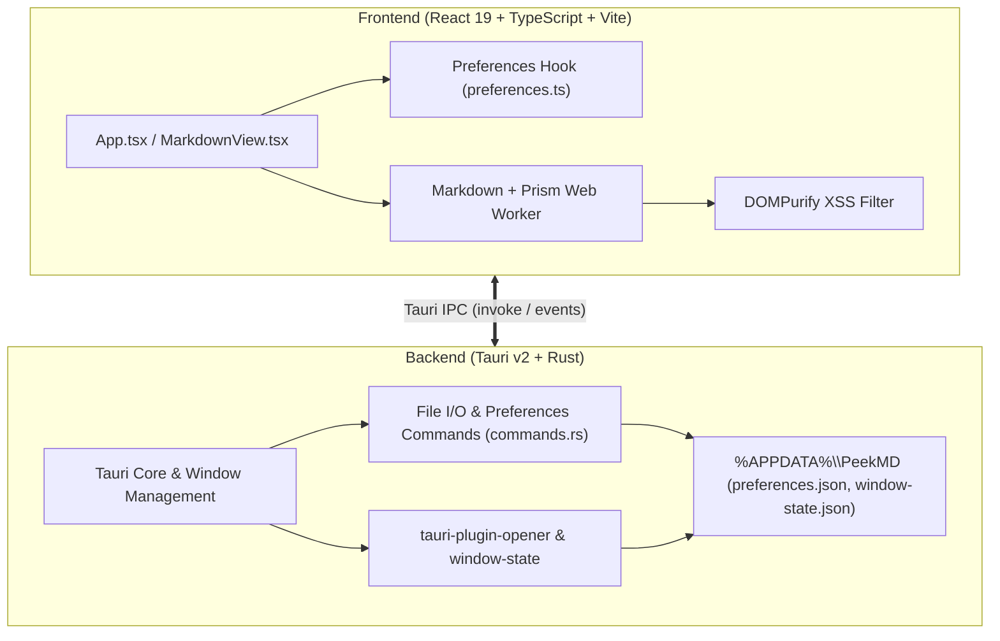

# PeekMD

<p align="center">
  <strong>A fast, lightweight, and minimal Markdown viewer for Windows.</strong>
</p>

<p align="center">
  
</p>

<p align="center">
  
  
  
  
  
  
  
</p>

---

## Overview

**PeekMD** is designed for one job: previewing Markdown files instantly. 

Instead of waiting for heavy IDEs, text editors, or bloated note-taking apps to spin up just to inspect a documentation file or notes, double-click any `.md` or `.markdown` file to open a clean, beautifully formatted, GitHub-styled document with near-zero memory footprint and sub-second launch times.

---

## Key Features

- ⚡ **Instant Startup & Zero Bloat**: Powered by **Tauri v2** and **Rust** for minimal resource consumption and instant window initialization.
- 📝 **GitHub Flavored Markdown (GFM)**: Full specification support for tables, task lists with interactive styling, blockquotes, strikethrough, autolinks, headings, and images.
- 🎨 **Code Syntax Highlighting**: Integrated **PrismJS** engine with syntax highlighting across Rust, TypeScript, JavaScript, Python, Bash, Go, C/C++, C#, SQL, YAML, JSON, and Markdown.
- 🔒 **Sanitized & Secure**: All rendered HTML is strictly sanitized through **DOMPurify** to prevent script injection (XSS). External hyperlinks open safely in your default web browser via native opener plugins.
- 🪟 **Native Windows Integration**: Custom `.md` and `.markdown` document icons in Windows Explorer, installer-managed file associations, dynamic window titles, and CLI argument launching (`peekmd <path>`).
- 🌓 **Themes & Typography**: A focused Windows-native document lens with persistent **System**, **Light**, and **Dark** themes.
- 🔍 **Zoom & View Controls**: Fluid typography zoom scaling (<kbd>Ctrl</kbd> + <kbd>+</kbd>, <kbd>Ctrl</kbd> + <kbd>-</kbd>, <kbd>Ctrl</kbd> + <kbd>0</kbd>, or <kbd>Ctrl</kbd> + <kbd>Mouse Wheel</kbd>).
- 📂 **Drag & Drop**: Drop any `.md` or `.markdown` file directly onto the window with visual drop-zone feedback.
- 💾 **Transparent State Persistence**: Settings and window geometry are saved directly to `%APPDATA%\PeekMD\` as JSON files.
- 📋 **Native Context Menu**: Clean right-click menu tailored for copying selected text or full code blocks without browser context clutter.

---

## Data Storage & State Persistence

PeekMD keeps all user preferences and window state transparently organized under a dedicated application folder on Windows:

```text
%APPDATA%\PeekMD\
├── preferences.json   # Theme ('system', 'light', 'dark') & Zoom level (0.6 - 2.4)
└── window-state.json  # Last window dimensions, position (x, y), and maximized state
```

### Example `preferences.json`
```json
{
  "theme": "dark",
  "zoom": 1.2
}
```

- **Read-Only Document Handling**: PeekMD never mutates or caches the contents of opened Markdown documents on disk. Files are loaded strictly in-memory during active sessions.
- **Zero Cloud Sync / Zero Telemetry**: All data remains 100% offline and local to your system.

---

## Keyboard Shortcuts & Gestures

| Shortcut / Action | Description |
| :--- | :--- |
| <kbd>Ctrl</kbd> + <kbd>O</kbd> | Open a Markdown file using the native file picker |
| <kbd>Ctrl</kbd> + <kbd>R</kbd> / <kbd>F5</kbd> | Reload the current document from disk |
| <kbd>Ctrl</kbd> + <kbd>T</kbd> | Cycle theme (`System` → `Light` → `Dark`) |
| <kbd>Ctrl</kbd> + <kbd>+</kbd> / <kbd>=</kbd> / <kbd>Numpad +</kbd> | Zoom in (increase font scale) |
| <kbd>Ctrl</kbd> + <kbd>-</kbd> / <kbd>_</kbd> / <kbd>Numpad -</kbd> | Zoom out (decrease font scale) |
| <kbd>Ctrl</kbd> + <kbd>0</kbd> / <kbd>Numpad 0</kbd> | Reset zoom level to default (100%) |
| <kbd>Ctrl</kbd> + <kbd>Mouse Wheel</kbd> | Zoom in / out dynamically |
| **Drag & Drop** | Drop any `.md` or `.markdown` file into the window |
| **Right-Click** | Context menu to copy text/code blocks or open files |
| <kbd>Esc</kbd> | Dismiss context menu |

---

## Architecture & Tech Stack



- **Frontend**: [React 19](https://react.dev/), [TypeScript](https://www.typescriptlang.org/), [Vite](https://vite.dev/)
- **Markdown & Security**: [Marked](https://marked.js.org/), [PrismJS](https://prismjs.com/), [DOMPurify](https://github.com/cure53/DOMPurify)
- **Backend Desktop Runtime**: [Tauri v2](https://v2.tauri.app/), [Rust](https://www.rust-lang.org/)
- **Native OS Plugins & Storage**: `tauri-plugin-opener`, `tauri-plugin-window-state`, `rfd` (file dialogs), `%APPDATA%\PeekMD` persistent JSON storage

---

## Project Structure

```text
PeekMD/
├── public/                 # Static assets (App icon)
├── src/                    # Frontend React application
│   ├── components/         # React UI components
│   │   ├── ContextMenu.tsx # Minimal right-click context menu
│   │   ├── DocumentStrip.tsx# Top control bar (title, zoom, theme, file actions)
│   │   └── MarkdownView.tsx# Document container, empty/error states, link handler
│   ├── lib/
│   │   ├── documentController.ts # Document lifecycle & IPC coordination
│   │   ├── preferences.ts  # Theme & zoom persistence (backend + fallback)
│   │   └── sanitize.ts     # DOMPurify HTML sanitization pipeline
│   ├── styles/
│   │   └── app.css         # GitHub-inspired light & dark theme styling & typography
│   ├── workers/
│   │   └── markdown.worker.ts # Web worker for parsing Markdown & syntax highlighting
│   ├── App.tsx             # Main view, keyboard shortcuts, zoom & drag-and-drop
│   └── main.tsx            # React application entry point
├── src-tauri/              # Rust desktop backend
│   ├── src/
│   │   ├── commands.rs     # File reading, preferences I/O, dialog commands
│   │   ├── lib.rs          # Tauri application builder & plugin configuration
│   │   └── main.rs         # Tauri binary entry point
│   ├── Cargo.toml          # Rust dependencies & configuration (v1.1.1)
│   └── tauri.conf.json     # Tauri app, window, bundle & file association settings
├── index.html              # HTML shell
├── package.json            # Node.js scripts & frontend dependencies (v1.1.1)
├── LICENSE                 # PolyForm Noncommercial License 1.0.0
├── tsconfig.json           # TypeScript configuration
└── vite.config.ts          # Vite build configuration
```

---

## Getting Started

### Prerequisites

Ensure you have the following installed on your Windows machine:

1. **[Node.js](https://nodejs.org/)** (v18 or higher)
2. **[Rust & Cargo](https://rustup.rs/)** (v1.75 or higher)
3. **C++ Build Tools** (via [Visual Studio Build Tools](https://visualstudio.microsoft.com/visual-cpp-build-tools/) or Visual Studio with "Desktop development with C++" workload)

### Installation & Development

1. **Clone the repository**:
   ```bash
   git clone https://github.com/your-username/peekmd.git
   cd peekmd
   ```

2. **Install dependencies**:
   ```bash
   npm install
   ```

3. **Launch in development mode**:
   ```bash
   npm run tauri dev
   ```

### Production Build

To generate an optimized release binary and Windows installer (NSIS / MSI):

```bash
npm run tauri build
```

The compiled binary (`peekmd.exe`) and installers will be output to:
```text
src-tauri/target/release/bundle/
```

---

## Testing & Quality

### Rust Backend Tests
Run the unit test suite verifying file reading, preferences management, normalization, and path handling:

```bash
cargo test --manifest-path src-tauri/Cargo.toml
```

### Frontend Type Check & Build
Verify TypeScript types and Vite bundle integrity:

```bash
npm run build
```

---

## License

This project is licensed under the [PolyForm Noncommercial License 1.0.0](LICENSE).

> Required Notice: Emirhan Akdeniz, github.com/emirhanakdeniz

In short, this license permits any **noncommercial** use of PeekMD — including personal use, hobby projects, and use by charitable, educational, research, public safety/health, environmental, and governmental organizations — as well as changes and redistribution of the software for noncommercial purposes, provided that the license terms and the Required Notice above are passed along. Commercial use is not permitted under these terms; contact the licensor if you need a commercial license.
